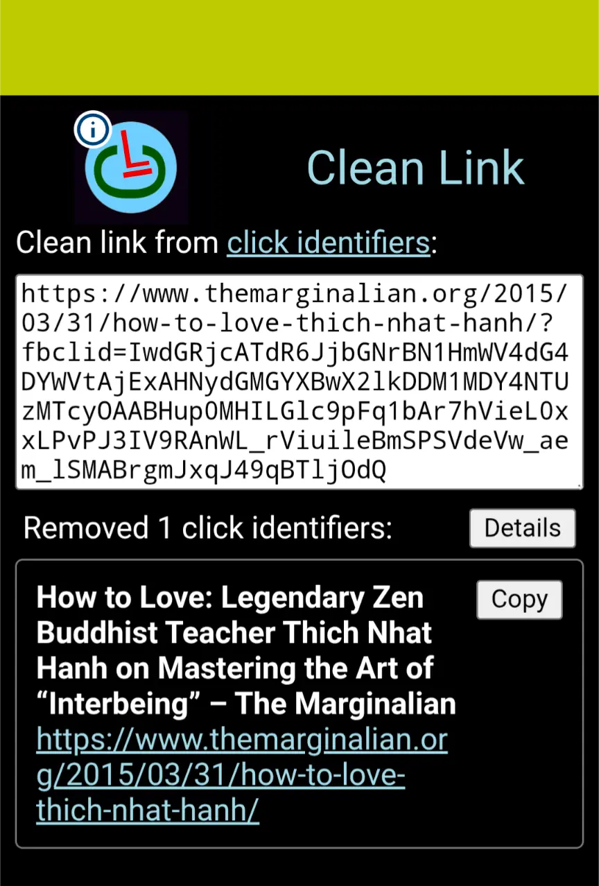

# Clean Link

The web page __Clean Link__ can remove [click identifiers](https://en.wikipedia.org/wiki/Click_identifier) from a link.
Just enter the link that may contain click identifier and immediately get a cleaned and much shorter link that you can copy and use on social media etc:

<!-- Final high-performance tag for your above-the-fold screenshot -->
<figure>

<figcaption>Screenshot, share target</figcaption>
</figure>

To use __Clean Link__ open this web page:
* [https://lborgman.github.io/text-and-link/text-and-link.html](https://lborgman.github.io/text-and-link/text-and-link.html)
(in your web browser, not inside the social media where you might be reading this information page).

## Share target

On some devices you can send links directly to this app from any other application on your device using your system's native share.  (Currently this only works well on __Android devices/mobiles__.)

1. __Install this web page__

   - For the share feature to work the web page __Clean Link__ must be installed (in your web browser) on your device.
   - Open this web page in your mobile browser (I have tested only in __Google Chrome__ and I think that it currently can work on with Goggle Chrome).
   - Tap your browser's menu (it looks like __⋮__) and select __Install and create shortcut__. (The name of the menu entry may change with future web browser version.)

1. __Share Content From Other Apps__

   - Then open any app (such as Twitter, YouTube, or your mobile browser).
   - Find something you want to share, and tap the native __Share icon__ ()
   - Look through your device's popup share sheet menu. Tap the icon for __Clean Link__ from the list of available apps:

1. __What Happens Next__

   - __Clean Link__ will automatically launch.
   - The shared link will instantly pre-fill, allowing you to copy immediately with the click identifiers removed.
